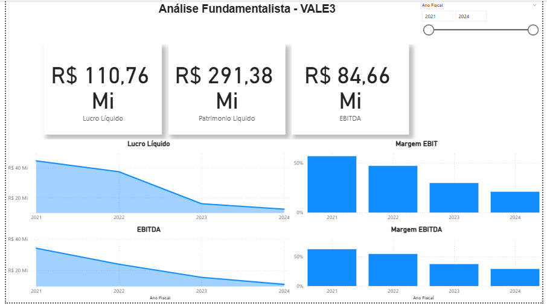
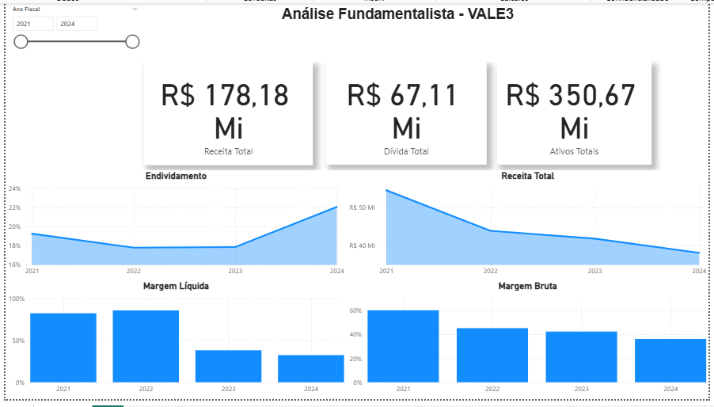

# 📈 Análise Fundamentalista - VALE3

Este dashboard interativo foi desenvolvido em Microsoft Power BI para fornecer uma análise detalhada da saúde financeira e do desempenho fundamentalista da VALE3 (Vale S.A.), com base em seus demonstrativos financeiros.

## Objetivo:

O principal objetivo é visualizar as tendências de métricas financeiras essenciais e indicadores de desempenho ao longo dos anos, permitindo uma compreensão clara da performance da empresa para fins de investimento e análise de negócio.

## Fonte dos Dados:

Dados extraídos dos demonstrativos financeiros anuais (DRE, Balanço Patrimonial e Fluxo de Caixa) da VALE3, obtidos via Yahoo Finance.

## Tecnologias e Ferramentas Utilizadas:

* **Microsoft Power BI Desktop:** Ambiente principal para o desenvolvimento do dashboard.
* **Power Query:** Essencial para a conexão, limpeza, transposição e transformação dos dados financeiros brutos (DRE, Balanço Patrimonial, DFC), garantindo a integridade e a estrutura adequada para a análise.
* **DAX (Data Analysis Expressions):** Utilizado para criar medidas e indicadores fundamentalistas complexos, como Receita Total, Lucro Líquido, EBIT, EBITDA, Ativos Totais, Dívida Total, e as Margens (Bruta, Líquida, EBIT, EBITDA) e Endividamento.
* **Modelagem de Dados:** Criação de um modelo estrela robusto com uma tabela `Calendario` para análise temporal.

## Principais Métricas e Visualizações:

O dashboard apresenta uma visão abrangente com:

* **KPIs de Desempenho:** Cartões exibindo valores totais de Receita Total, Lucro Líquido, EBITDA, Ativos Totais, Patrimônio Líquido e Dívida Total.
* **Tendências de Faturamento e Lucratividade:** Gráficos de linha e área para visualizar a evolução anual de Receita Total, Lucro Líquido e EBITDA.
* **Análise de Margens:** Gráficos de linha/barras para as tendências de Margem Bruta, Margem Líquida, Margem EBIT e Margem EBITDA, mostrando a eficiência operacional e rentabilidade.
* **Análise de Endividamento:** Gráfico de linha para a tendência do indicador de Endividamento (Dívida Total / Ativos Totais), crucial para avaliar a alavancagem da empresa.
* **Segmentador por Ano Fiscal:** Permite uma navegação e filtragem rápida dos dados por ano.

## Dashboard Interativo:

Abaixo, uma prévia do dashboard interativo:

*Observação: O arquivo .pbix completo está disponível nesta pasta para download e exploração.*
