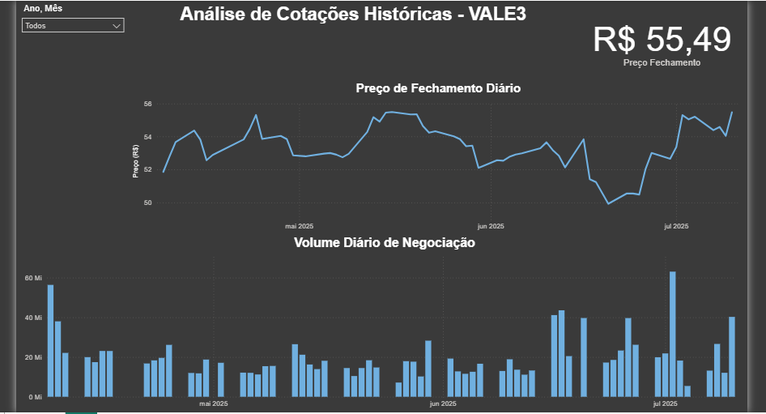

# 📈 Dashboard de Análise de Cotações - VALE3

Este projeto apresenta um dashboard interativo desenvolvido em Power BI para analisar o desempenho histórico da ação VALE3, com foco nos últimos 3 meses de dados.

## Objetivo:

O principal objetivo deste dashboard é fornecer uma visualização clara e concisa das tendências de preço e volume de negociação da VALE3, permitindo uma análise rápida do comportamento do ativo.

## Fonte dos Dados:

Os dados históricos de cotações da VALE3 foram obtidos através do Yahoo Finance.

## Tecnologias e Ferramentas Utilizadas:

* **Microsoft Power BI Desktop:** Ambiente de desenvolvimento do dashboard.
* **Power Query:** Utilizado para conectar-se aos dados brutos, realizar a limpeza (tratamento de datas, remoção de caracteres especiais em volume e porcentagem, conversão de tipos de dados) e transformações necessárias para a análise.
* **DAX (Data Analysis Expressions):** Empregado para criar medidas essenciais, como o "Último Preço de Fechamento" e o "Volume Total Negociado", e para a modelagem de dados (criação da Tabela Calendário e relacionamento).

## Principais Métricas e Visualizações:

* **Último Preço de Fechamento:** Cartão exibindo o valor mais recente da cotação.
* **Preço de Fechamento Diário:** Gráfico de linha que ilustra a evolução do preço de fechamento ao longo do tempo.
* **Volume Diário de Negociação:** Gráfico de colunas que mostra o volume de ações negociadas por dia, indicando a liquidez e o interesse no ativo.
* **Segmentador de Dados:** Permite filtrar a análise por ano e mês para uma exploração detalhada dos períodos.

## Dashboard Interativo:

Abaixo, uma prévia do dashboard interativo:

*Observação: O arquivo .pbix completo está disponível nesta pasta para download e exploração.*
